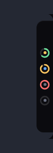
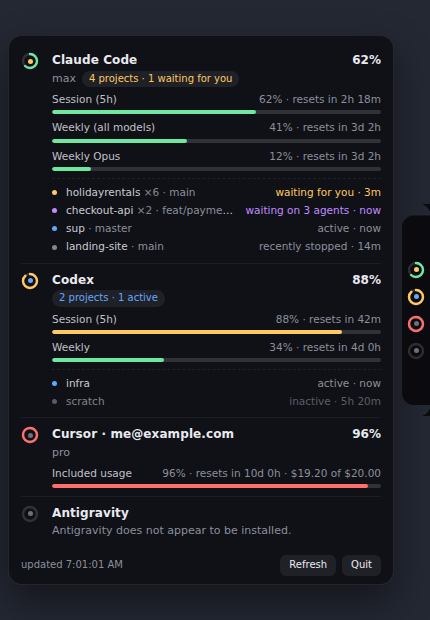

# sup

*Asking your AI coding tools what's up.*

A small tab clinging to the edge of your screen that shows how much of your AI
coding assistants' usage limits you have left.

Hover it and it unfolds: every rate-limit window, how full it is, when it
resets, and whether that assistant is currently working or waiting on you.

There is nothing to sign in to. `sup` reads the credentials and session logs
your coding tools already keep on disk, and talks to the same endpoints those
tools do.





## Install

### Debian / Ubuntu

```bash
sudo apt install ./supbar_0.1.2_amd64.deb
supbar
```

The package installs a desktop entry, so it also shows up in your launcher.
Turn on **Start at login** from the tray menu to have it come back after a
reboot (it writes `~/.config/autostart/supbar.desktop`).

The command is `supbar`; settings and everything else still live under the
project's own name, `sup`.

### AppImage

```bash
chmod +x supbar-0.1.2-x86_64.AppImage
./supbar-0.1.2-x86_64.AppImage
```

### Windows

Run the NSIS installer, or use the portable `.exe`. The builds are unsigned, so
SmartScreen will warn before it lets you run either — *More info* then *Run
anyway*. Same codebase and same providers as Linux; the differences are that
Antigravity discovery is Linux-only, and that without process matching (also
Linux-only) a finished session cannot be told apart from a closed one.

If the tray icon appears but no tab does, use **Show tab (reset position)** in
the tray menu, and see the diagnostics below.

## What it reads, and from where

| Provider | Credentials | Usage source |
| --- | --- | --- |
| **Claude Code** | `~/.claude/.credentials.json` (`claudeAiOauth.accessToken`), or `CLAUDE_CODE_OAUTH_TOKEN` | `GET https://api.anthropic.com/api/oauth/usage` — the same endpoint behind `/usage` in the CLI |
| **Codex** | `~/.codex/auth.json` (`tokens.access_token`) | `GET https://chatgpt.com/backend-api/wham/usage`, falling back to the `rate_limits` block in `~/.codex/sessions/**/*.jsonl` |
| **Cursor** | `cursorAuth/accessToken` in `~/.config/Cursor/User/globalStorage/state.vscdb` | `GET https://cursor.com/api/usage-summary`, falling back to `/api/usage?user=…` |
| **Antigravity** | the CSRF token on the running language server's command line | `RetrieveUserQuotaSummary` on the IDE's local language server (`https://127.0.0.1:<port>`) |

Multiple Claude accounts are picked up automatically: anything in
`CLAUDE_CONFIG_DIR`, plus `~/.claude` and any `~/.claude-<name>` directory, each
shown as its own ring.

### Privacy

Credentials are read from disk and sent only to the service that issued them.
Nothing is uploaded anywhere else, there is no telemetry, and `sup` never writes
to your tools' credential files — if a Claude token has expired it says so and
asks you to start Claude Code, rather than racing it for the file.

### Session state

Every open session gets its own row, not one row per tool. None of the CLIs
publish a status file, so each row's state is inferred from two things: the
transcript that CLI is already writing, and whether one of its processes is
still sitting in that project directory. The second half is what separates
"finished, your turn" from "that session is over".

| State | What it means | How it is decided |
| --- | --- | --- |
| **active** | generating or running a tool right now | the transcript was written to in the last 90s, or a tool call is still unanswered |
| **waiting on agents** | blocked on subagents it dispatched | an unanswered `Task` call, or a backgrounded `Bash` |
| **waiting for you** | it asked you something outright | an unanswered `AskUserQuestion` or `ExitPlanMode` |
| **recently stopped** | finished, or the session ended, in the last 30 minutes | the turn is over, or no CLI process is left in that directory |
| **inactive** | old, nothing happening | idle beyond the thresholds above |

"Waiting for you" deliberately means the session *asked* something. A turn
simply ending is not a question — every finished turn ends the same way, so
counting that would mark every idle session as needing attention. Claude Code's
permission prompts are not written to the transcript at all, so those cannot be
detected from here; such a session reads as active until its tool call resolves.

One row per project, not per transcript. Every `claude` run in a directory
writes its own session file, so a project worked on all day would otherwise
fill the list with identical rows; they collapse onto the project, keeping
whichever state most wants your attention and the most recent activity. A
`×6` after the name is the number of sessions behind that row, and a project
blocked on subagents reads "waiting on 3 agents" — counted from unanswered
`Task` calls, since subagents run inside the parent transcript rather than
getting files of their own.

Rows are sorted by how much they want your attention, and each shows the
project and git branch — both read from the transcript itself, so Codex
sessions are named after their working directory rather than the dated folder
they happen to live in.

Process matching is Linux-only for now (it reads `/proc`). Elsewhere the state
falls back to the transcript alone, which cannot tell "recently stopped" from
"waiting for you".

## Configuration

Everything lives in `~/.config/sup/settings.json`, and the common options are in
the tray menu (edge, screen, which providers to show, transparency, start at
login).

```jsonc
{
  "edge": "right",          // top | bottom | left | right
  "display": "primary",     // "primary" | "cursor" | display index
  "offset": 0,              // pixels along the edge, away from centre
  "collapsedWidth": 190,    // the tab's length along its edge
  "collapsedHeight": 28,    // and its depth into the screen
  "expandedWidth": 400,
  "expandedHeight": 520,
  "pollIntervalMs": 180000, // providers enforce their own floor as well
  "enabled": { "claude": true, "codex": true, "cursor": true, "antigravity": true },
  "blink": true,            // blink the tab's dot while a session is running
  "transparent": true,      // set false if you have no compositor
  "windowType": "toolbar",  // X11 window type hint
  "cursorCookie": null,     // "<userId>::<jwt>" if you only sign in on the web
  "warnAt": 75,
  "dangerAt": 90
}
```

### Quitting, and CPU

**Quit** sits next to Refresh at the bottom of the panel — hover the tab, then
click it. The tray menu has the same option, but plenty of desktops (GNOME
without an AppIndicator extension, for one) never show a tray at all, so the
panel does not depend on it. Failing both, `pkill supbar`.

Idle cost is about 2% of one core. The dot on the tab blinks while a session is
active, which is a discrete repaint roughly once a second rather than a CSS
animation: on an always-on-top transparent window, animating one 5px dot at
frame rate measured over three times the entire app's idle CPU. Set
`"blink": false` to stop even that.

### Wayland

Wayland gives applications no way to place a window at a fixed screen position,
so `sup` asks Chromium for X11 and runs through XWayland, where the tab lands
exactly where you put it. If you would rather run natively, set
`SUP_OZONE=wayland` — it will still work, but your compositor decides where the
window goes.

## Troubleshooting

Run the probe to see exactly what each provider found and why:

```bash
npm run probe               # all providers
npm run probe -- cursor     # one of them
npm run probe -- antigravity --raw   # dump the language server's replies
```

- **`ERROR:...Add _NET_WM_WINDOW_TYPE_TOOLBAR to kAtomsToCache` on startup** — a
  harmless Electron log about its X11 atom cache; the tab still gets the right
  window type.
- **A black rectangle instead of a tab** — no compositor is running. Set
  `"transparent": false`, or untick *Transparent background* in the tray menu.
- **The tab sits behind a panel or dock** — some window managers ignore
  always-on-top for `toolbar` windows. Try `"windowType": "notification"` or
  `"dock"`.
- **Claude shows "token rejected"** — the stored access token expired. Start
  Claude Code once and it will refresh it.
- **Cursor shows "not signed in" although it is** — Cursor had not flushed its
  SQLite write-ahead log yet. Quit Cursor once, or paste a session cookie into
  `cursorCookie`.
- **Antigravity shows "not running"** — quota is only readable while the IDE is
  open; it lives in the language server, not on disk.
- **Tray icon but no tab on screen** — try *Show tab (reset position)* in the
  tray menu, then untick *Transparent background* (some setups cannot composite
  a transparent window). To capture what happened, run with diagnostics on:

  ```powershell
  $env:SUP_DEV=1; & "$env:LOCALAPPDATA\Programs\Sup\supbar.exe"
  ```

  ```bash
  SUP_DEV=1 supbar
  ```

  That writes `sup.log` next to `settings.json` (`%APPDATA%\Sup` on Windows,
  `~/.config/sup` elsewhere), recording the window's bounds and how it was
  shown.

## Development

```bash
npm install
npm start          # run the app
npm test           # parser and placement tests, no Electron needed
npm run dist:deb   # build dist/supbar_<version>_amd64.deb
npm run dist:linux # deb + AppImage
npm run dist:win   # NSIS installer + portable exe (run on Windows, or with wine)

node scripts/make-icons.js                    # regenerate assets/icons from code
npx electron scripts/screenshot.js            # regenerate docs/preview from the real UI
SUP_DEV=1 npm start                           # log provider results and window bounds
```

### Continuous integration

`docs/github-actions-build.yml` runs the tests, then builds the Linux packages
on `ubuntu-latest` and the Windows installers on `windows-latest`, attaching
everything to a release on a `v*` tag. Copy it into place to enable it:

```bash
mkdir -p .github/workflows
cp docs/github-actions-build.yml .github/workflows/build.yml
```

(It ships outside `.github/` because pushing workflow files needs a token with
the `workflow` scope.)

### Adding a provider

Drop a module in `src/main/providers/` exporting `{ id, label, minIntervalMs,
collect }`, where `collect()` resolves to an array of results built with the
helpers in `src/main/lib/shape.js`, then register it in
`src/main/providers/index.js`. The renderer needs no changes — it draws whatever
windows a provider reports.

## Licence

MIT.
